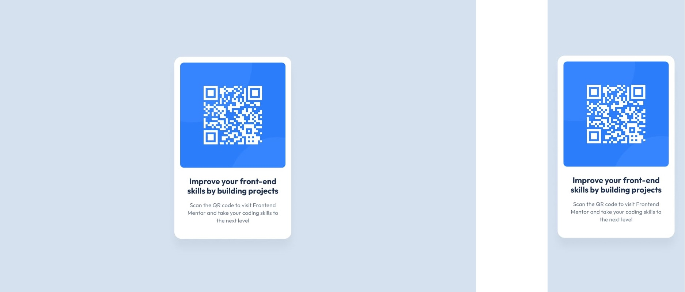

#  QRcode_Component 

## Table of contents

  - [Challenge](#challenge)
  - [Webpage](#webpage)
    - [Design](#design)
    - [Solution](#solution)
  - [Implementation](#implementation)
  - [Author](#)

## CHALLENGE

  Show in webpage a QR code to visit Frontendmentor site, based in giving design by the challenge.

## WEBPAGE

  ### Design: Desktop (1440px) and Mobile (375px) preview

  

  ### Solution

  - GitHub Page URL: [**https://utdevolt.github.io/QRcode_Component/**](https://utdevolt.github.io/QRcode_Component/)

## IMPLEMENTATION

  ### The project was developed only by using HTML and CSS code.
  
  ### Main concept that I use was `display:flex` feature, due to flexibility to position the boxes as closely possible.  
  
  ### The web was supported on live URL by the `PAGE` tools offer by GitHub.
  
  ### I develop the code based on the information from the following sites: 
  - https://developer.mozilla.org/en-US/docs/Web/CSS
  - https://lenguajecss.com/css/
  - https://www.markdownguide.org/basic-syntax/

## AUTHOR

  - Dayvid Ramos M.
